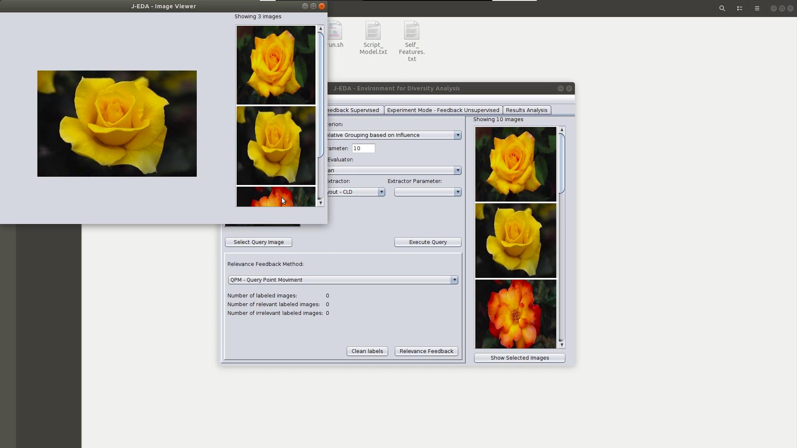

# The J-EDA Workbench #

**Attention**: J-EDA is **not** a commercial software. It is designed for educational and demonstration purposes **only**.

J-EDA is a practical workbench for the analysis of the impact of five content-based image retrieval parameters.
The system enables users to provide image datasets to be either processed feature extractors or to be associated with multidimensional representations provided in a separated .csv file.
Next, users can inspect a broad set of search parameters as distance functions,  query criteria, result diversification, and relevance feedback methods.
Data evaluation is carried out through an Experimental interface by incremental batch procedures that generate distinct metrics for supervised and unsupervised datasets. 
Consolidated metrics, including elapsed time, are reported in a separated interface with easy-to-follow graphics and tables.

J-EDA was implemented in [JAVA](https://www.oracle.com/technetwork/pt/java/javase/downloads/index.html) by using open-source [OpenCV 4](https://opencv.org/opencv-4-0/) and [JFreeChart](http://www.jfree.org/jfreechart/index.html) libraries.

Despite the authors' best efforts to release the prototypes without errors, there may be some issues. 
If you encounter any problems or want to add new features, please report it.


### 1. Minimum requirements ###

* Screen resolution: 1280×800 (or higher)
* 200 MB free disk space (For installation!).
* 2 GB RAM.
* Intel Core™2 Duo P8600 core processor.
* Java JDK 8 (or higher)

### 2. Using J-EDA ###

J-EDA is primarily designed for Debian Linux-based systems. 
The installation process as below was tested on a [Ubuntu 18.04](http://releases.ubuntu.com/18.04/). 
Although the steps are similar for other distributions, it may be necessary to install third-party packages manually. 

  

**2.1 Download**

* Clone or download this project.
* Unzip the downloaded files.
* The following files are expected to be in the final directory:

```
  EDA
    ├── Corel_class.txt
    ├── Corel_Colorhist.txt
    ├── dist
    │   ├── lib
    │   │   ├── jcommon-1.0.23.jar
    │   │   ├── jfreechart-1.0.19.jar
    │   │   └── opencv-400.jar
    │   └── Projeto.jar
    ├── lib
    │   └── libopencv_java400.so
    ├── Main.png
    ├── README.md
    ├── run.sh
    ├── Script_Model.txt
    └── Self_Features.txt

3 directories, 12 files
```

**2.2 Running experience**

J-EDA binary file is run.sh. 
Grant it permission by using the command chmod + x run.sh and execute with command sudo ./run.sh.

List of packages required by J-EDA:
  * libjasper1 
  * libjasper-dev 
  * libavcodec-dev 
  * libavformat-dev 
  * libswscale-dev 
  * libdc1394-22-dev 
  * execstack


**2.3 Resources**

The following literature resources have been implemented, tested, and are available on J-EDA:

* Seven features extractors: Color Layout, Color Structure, Dominant Color, Edge Histogram, Haralick, Local Binary Pattern, and Scalable Color [8].

* Five distance functions: Bray-Curtis, Canberra, Chebyshev, Euclidean and Manhatan [5].

* Seven query algorithms (with and without diversity): Better Result with Influence Diversification (BRIDk) [4], First Match (FM) [9], Greedy Marginal Contribution (GMC) [6], k-Nearest Neighbors Query (kNNq), Maximal Marginal Relevance (MMR) [6], Relative Grouping based on Influence (ReGi) [3], and Range Query (Rq).

* Three Relevance Feedback (RF) techniques: Query Point Movement [2], Vector Support Machine [1] and Similarity Refinement Evaluator [7].

* Six Evaluation Metrics: Precision and Recall, Mean Average Precision - mAP, Average Recall - AR, Number of Relevant and Irrelevant Images by Iteration, Query and RF Execution Time.


**2.4 Query Parameters**

Query parameters differ depending on the query criteria and its corresponding algorithm. 
The following list describes the expected set of parameters to be used by each algorithm:

* Better Result with Influence Diversification (BRIDk), k-Nearest Neighbors Query (kNNq) and Relative Grouping based on Influence (ReGi): Expects an integer (k) that indicates the number of images that should be part of the result set.

* First Match (FM): It receives an integer (k) that indicates the number of images to be returned, and a number e >= 0 that indicates the minimum separation distance between the images in the result set.

* Greedy Marginal Contribution (GMC) and Maximal Marginal Relevance (MMR): It expects an integer (k) that indicates the number of images to be returned, a value in the interval [0; 1] that indicates the diversity preference of the user, and an integer that indicates the proportion of images that should be used during the optimization phase.

* Range Query (Rq): It receives a number e > 0 that indicates the maximum distance threshold.

### 3. Usage Demonstration Video ####



The following [Youtube video](https://youtu.be/K0lDmfTeOZ0) demonstrates J-EDA main features.

### 4. Additional Information and Legal Note ####

The demonstration binary file is under GPLv2 restrictions due to free use of [JAVA](http://openjdk.java.net/legal/) requirements.

This repository contains a demonstration, any express or implied warranties, including without limitation the implied warranties of merchantability and fitness for a particular purpose are waived. Under no circumstances will the authors of this software or its contributors be liable for any direct, indirect, incidental, special, exemplary or consequential damages (including, but not limited to, acquiring substitute goods or services, loss of use, data or profits, or business interruption), but caused and in any theory of liability in the contract, objective liability or unlawful act (including negligence or otherwise) arising in any way in the use of this statement, even if advised of the possibility of such damage.

### References ####

[1] A. MARAKAKIS, N. P. GALATSANOS, A. LIKAS AND A. STAFYLOPATIS. RELEVANCE FEEDBACK FOR CONTENT-BASED IMAGE RETRIEVAL USING SUPPORT VECTOR MACHINES AND FEATURE SELECTION. IN ICANN, PAGES 942--951, LIMASSOL, CYPRUS, 2009.

[2] J. J. ROCCHIO. RELEVANCE FEEDBACK IN INFORMATION RETRIEVAL. IN G. SALTON (ED.),THE SMART RETRIEVAL SYSTEM-EXPERIMENTS IN AUTOMATIC DOCUMENT PROCESSING, PAGES 313--323, ENGLEWOOD CLIFFS, NJ, PRENTICE-HALL, 1971.

[3] L. F. D. SANTOS, L. O. OLMES, M. V. N. BEDO, A. J. M. TRAINA, AND C. TRAINA JR. WHEN SIMILARITY IS NOT ENOUGH, ASK FOR DIVERSITY: GROUPIN ELEMENTS BASED ON INFLUENCE. IN ISM, PAGES 26--29, SAN JOSE, CALIFORNIA, 2016.

[4] L. F. D. SANTOS, W. D. OLIVEIRA, M. R. P. FERREIRA, A. J. M. TRAINA, AND C. TRAINA JR. PARAMETER-FREE AND DOMAIN-INDEPENDENT SIMILARITY SEARCH WITH DIVERSITY. IN SSDBM, PAGES 5:1--5:12, BALTIMORE, MARYLAND, 2013.

[5] M. M. DEZA AND E. DEZA. ENCYCLOPEDIA OF DISTANCES. SPRINGER BERLIN HEIDELBERG, 2009.

[6] M. R. VIEIRA, H. L. RAZENTE, M. C. N. BARIONI, M. HADJIELEFTHERIOU, D. SRIVASTAVA, C. TRAINA JR, AND V. J. TSOTRAS. ON QUERY RESULT DIVERSIFICATION. IN ICDE, PAGES 1163--1174, HANNOVER, GERMANY, 2011.

[7] K. PORKAEW AND K. CHAKRABARTI. QUERY REFINEMENT FOR MULTIMEDIA SIMILARITY RETRIEVAL IN MARS. IN ACM MM, PAGES 235--238, ORLANDO FLORIDA, 1999. 

[8] P. SALEMBIER AND T. SIKORA. INTRODUCTION TO MPEG-7: MULTIMEDIA CONTENT DESCRIPTION INTERFACE. IN B. S. MANJUNATH (ED.), NEW YORK, NY, JOHN WILEY & SONS, 2002,

[9] T. SKOPAL, V. DOHNAL, M. BATKO AND P. ZEZULA. DISTINCT NEAREST NEIGHBORS QUERIES FOR SIMILARITY SEARCH IN VERY LARGE MULTIMEDIA DATABASES. IN WIDM, PAGES 11--14, HONG KONG, CHINA, 2009.