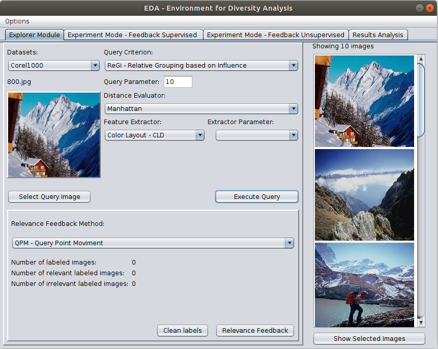

# The EDA Project #

**Attention**: EDA is **not** clinical or commercial software. It is designed for educational and demonstration purposes.

EDA, is an environment that allows the user to analyze the results generated by different search approaches for similarity with diversity. The system uses RF techniques to include the user in the retrieval process, so that he can iteratively evaluate the results generated and adjust the process to his intention, without the need to reformulate the search.

It has been implemented in [Java](https://www.oracle.com/technetwork/pt/java/javase/downloads/index.html), with the help of the [OpenCV 4](https://opencv.org/opencv-4-0/) and [JFreeChart](http://www.jfree.org/jfreechart/index.html) libraries.   

Despite the authors' efforts to release the prototypes without errors, there may be some problems. If you encounter any problems or wish to add new features, please contact us.

### 1. Minimum requirements ###

* Screen resolution: 1280×800 (or higher)
* 200 MB free disk space (For installation!).
* 2 GB RAM.
* Intel Core™2 Duo P8600 core processor.
* Java JDK 8 (or higher)
### 2. Usando o EDA ###

EDA was developed for Linux-based systems. The installation process described below has been tested on a [Ubuntu 18.04](http://releases.ubuntu.com/18.04/), For other distributions based on Ubuntu the operation may be similar, but it may be necessary to install some packages manually and, to date, other Linux distributions have not been tested.

  

  The following [video](http://youtube.com)  generically presents the system features.

**2.1 Download**

* Clone or download this project.
* If necessary unzip the downloaded file.
* The following files must be in the directory:

```
    EDA
    ├── Corel1000
    │   ├── 0.jpg
    │   ├── ...
    │   └── 999.jpg
    ├── Corel_class.txt
    ├── Corel_Colorhist.txt
    ├── dist
    │   ├── lib
    │   │   ├── jcommon-1.0.23.jar
    │   │   ├── jfreechart-1.0.19.jar
    │   │   └── opencv-400.jar
    │   └── Projeto.jar
    ├── Figures
    │   └── ...
    ├── lib
    │   └── libopencv_java400.so
    ├── README.md
    └── run.sh
    
    4 directories, 1012 files
```

**Query Parameters**
**2.2 Resources**

The following literature resources have been implemented, tested, and are available in the EDA:

* Seven features extractors: Color Layout, Color Structure, Color Story, Edge Histogram, Haralick, Local Binary Pattern, and Scalable Color.
<br/>

* Five distance functions: Bray-Curtis, Canberra, Chebyshev, Euclidean and Manhatan.
<br/>

* Seven query algorithms (with or without diversity): Better Result with Influence Diversification (BRIDk), First Match (FM), Greedy Marginal Contribution (GMC), K-Nearest Neighbors Query (kNNq), Maximal Marginal Relevance MMR), Relative Grouping based on Influence (ReGi) and Range Query (Rq).
<br/>

* Three Relevance Feedback techniques: Query Point Movement, Vector Support Machine and Similarity Refinement Evaluator.
<br/>
* Six Evaluation Metrics: Precision and Revocation, Average Average Precision - mAP, Average Recall - AR, Number of Relevant and Irrelevant Images by Iteration and Search Execution Time and RF Technique.

**2.3 Run**
  The run file is run.sh. Initially it is necessary to make this file an execult, for this use the command: chmod + x run.sh and to execute use: ./run.sh.

  In the first run it may be necessary to install some packages: ** [libjasper1 libjasper-dev libavcodec-dev libavformat-dev libswscale-dev libdc1394-22-dev execstack] **, in this case, the root password can be requested.


### 3. Additional Information and Legal Note ####

The demonstration binary file is under GPLv2 restrictions due to free use of [JAVA](http://openjdk.java.net/legal/) requirements.

This repository contains a demonstration, any express or implied warranties, including without limitation the implied warranties of merchantability and fitness for a particular purpose are waived. Under no circumstances will the authors of this software or its contributors be liable for any direct, indirect, incidental, special, exemplary or consequential damages (including, but not limited to, acquiring substitute goods or services, loss of use, data or profits, or business interruption), but caused and in any theory of liability in the contract, objective liability or unlawful act (including negligence or otherwise) arising in any way in the use of this statement, even if advised of the possibility of such damage.
